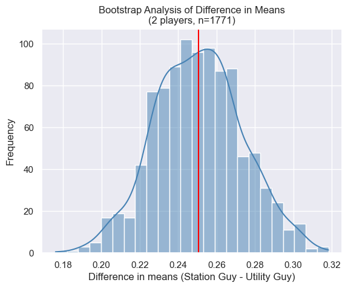
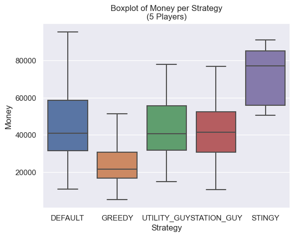
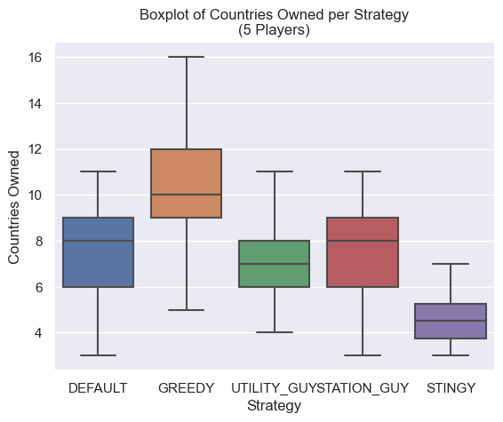

# 2023F CS2910 Project Report
**Group Members**
1. Zeyad Awad (362192)
2. Hashem Bader (362311)

# Summary of Game
The game is Monopoly and it is a boardgame of 2 to 8 players, which each player
has an initial money of $1500, a name and a strategy.
The player will throw the dice and will move around the board then an action will be
taken when a player lands on a square in the board. Players will start to lose money
eventually after few rounds and whoever loses his all money will be out of the game,
To win the game, there should be only one player left that still has money.
For more information, here is the link to the rules(https://www.hasbro.com/common/instruct/00009.pdf).

# Experiment Report
## Player Strategies
1. Greedy: 
    - Buys properties 70% of the time regardless of its type.
    - Builds a house 90% of the time if possible.
2. Stingy:
    - Buys properties 20% of the time regardless of its type.
    - Builds a house 10% of the time if possible.
3. Default:
    - Buys properties 50% of the time regardless of its type.
    - Builds a house 30% of the time if possible.
4. Station Guy: 
    - Buys properties 40% of the time, with an exception for stations, 90%.
    - Builds a house 30% of the time if possible.
5. Utility Guy: 
    - Buys properties 40% of the time, with an exception for utilities, 90%.
    - Builds a house 30% of the time if possible.

## Procedure
In the experiment, a game is created given the list of players with strategies and the board map. The winner of each trial is stored in a hash map which then exports the following data: strategy, money countries, utilities, stations, and totalLandsOwned of the winner into a CSV file for data analysis. When the simulation runs, information about each player is displayed before and after rolling the dice to give an understanding about what is happening. 

After the specified number of trials, e.g., 60, the program displays the number of games won per strategy. 

It is important to note that in a 2-player monopoly game, it is believed that 12% of the games in a simulation would not end (which matches our simulation!) according to this paper: [ESTIMATING THE PROBABILITY THAT THE GAME OF MONOPOLY NEVER ENDS](https://www.informs-sim.org/wsc09papers/036.pdf?fbclid=IwAR3kaMbPMHUb0MXR8hD9u8_w49IYBTQWYrQHd0auXGnQ3ssjdTwqRIlIDEs). For that reason, the program displays the number of non-ending games (which we defined to be when a player has more than 100,000$).
We then collect the CSV data for further data analysis in Python (mainly Pandas library). We compared a variety of games, namely:
- Greedy VS Stingy (2 players)
- Station Guy VS Utility Guy (2 players)
- All 5 strategies (5 players)

The results were interesting.

## Results

### Greedy vs Stingy:

| strategy | money | countries | utilities | stations | totalLandsOwned |
|----------|-------|-----------|-----------|----------|------------------|
| GREEDY   | 3514.0| 16.0      | 2.0       | 3.0      | 20.0             |
| STINGY   | 1492.0| 3.0       | 0.0       | 1.0      | 4.0              |

Table 1.0: Player Strategies and Holdings

| Strategy | Win rate    |
|----------|-------------|
| GREEDY   | 0.588738    |
| STINGY   | 0.411262    |

Table 1.1: Win Rate Per Strategy

### Station Guy vs Utility Guy:

| strategy      | money | countries | utilities | stations | totalLandsOwned |
|---------------|-------|-----------|-----------|----------|------------------|
| STATION_GUY   | 596   | 6         | 0         | 3        | 9                |
| UTILITY_GUY   | 514   | 5         | 1         | 3        | 9                |
| STATION_GUY   | 14766 | 13        | 0         | 2        | 15               |
| STATION_GUY   | 11620 | 13        | 1         | 4        | 18               |
| UTILITY_GUY   | 12665 | 9         | 1         | 1        | 11               |

Table 2.0: Player Strategies and Holdings

| strategy      | money | countries | utilities | stations | totalLandsOwned |
|---------------|-------|-----------|-----------|----------|------------------|
| STATION_GUY   | 5448.0| 11.0      | 1.0       | 3.0      | 14.0             |
| UTILITY_GUY   | 9578.0| 11.0      | 1.0       | 1.0      | 14.0             |

Table 2.1: Win Rate Per Strategy

### All 5 Strategies (5 players):

| Strategy    | Money  | Countries | Utilities | Stations | Total Lands Owned |
|-------------|--------|-----------|-----------|----------|-------------------|
| DEFAULT     | 41840.0| 7.0       | 0.0       | 1.0      | 8.0               |
| GREEDY      | 22306.0| 8.0       | 0.0       | 1.0      | 10.0              |
| STATION_GUY | 39085.0| 5.0       | 0.0       | 1.0      | 7.0               |
| STINGY      | 71761.0| 4.0       | 0.0       | 0.0      | 5.0               |
| UTILITY_GUY | 38827.0| 5.0       | 1.0       | 0.0      | 7.0               |

Table 3.0: Player Strategies and Holdings

| Strategy      | Percentage   |
|---------------|--------------|
| GREEDY        | 54.13%        |
| DEFAULT       | 17.99%        |
| STATION_GUY   | 15.19%        |
| UTILITY_GUY   | 10.77%        |
| STINGY        | 1.92%         |

Table 3.1: Win Rate Per Strategy

## Analysis
_An interpretation of your data explaining why one strategy is better than the other supported with 
data from your experiment.(500 words)_

# Reflection
_A reflection on your experiences with generative AI during this project. Provide a few sentences reflecting
on your experience with AI for each of the following prompts._ 

### What generative AI did you use, and what tasks did you use it for?
Chat gpt: supporting with the test cases to cover all the possible cases_

### How did you learn about the tools used by your group (delete ones that don't apply)?
_most of the tools that have been used were learned in the class. Some of the tools we had to search for it in google._

### Reflecting on your experience:
Generative AI was a little bit helpful, it helped with having ideas for making test cases for the code and the classes it has.
In another hand, it was not helpful in making codes that helps with calculating rents.
Overall, the generative AI helped with improving the test cases which made the code more effecient,
maybe adding some complicated functions that matches with the reality of the game
could you have made the project turned out better, other than that, most of the game was covered effeciently.

**Prompts to think about in writing your reflections if you worked with generative AI:**
- What went well using generative AI in this project?
- What went well using generative AI?
- What didn’t go well using generative AI?
- Were there any limitations you encountered using generative AI?
- How did your solution change/evolve/improve/degrade because of the generative AI?
- What could you have done so the project turned out better?

**Prompts to think about in writing your reflections if you didn't use generative AI:**
- Why did you choose not to use generative AI in this project?
- Were there particular problems that you encountered where you think generative AI would have helped?
- Were there particular things you were glad you learned to do yourself without the use of generative AI?
- What could you have done so the project would turn out better?

# Bonus Consideration:
Demonstrating well-structured, modular, and efficient code, along with comprehensive unit tests and code coverage to ensure robustness and reliability.
Tracking and displaying detailed game statistics, such as win/loss ratios, average game duration and other gameplay metrics.