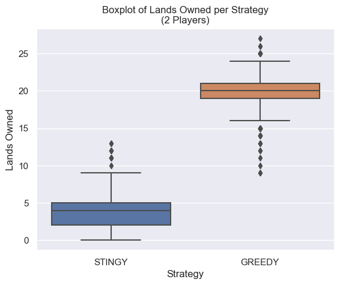

# 2023F CS2910 Project Report
**Group Members**
1. Zeyad Awad (362192)
2. Person 2 (Student Number)

# Summary of Game
_A summary description of the game that you chose.  This should include the name of the game, 
the goal of the game and a brief description of the key objects in the game. Please provide a link to the game and/or its rules online. (100 words)_

# Experiment Report
## Player Strategies
_For each of 3 STRATEGY you implemented, name the strategy, and then description of it (100 words each)_
1. Greedy: 
    - Buys properties 70% of the time regardless of its type.
    - Builds a house 90% of the time if possible.
2. Stingy:
    - Buys properties 20% of the time regardless of its type.
    - Builds a house 10% of the time if possible.
3. Default:
    - Buys properties 50% of the time regardless of its type.
    - Builds a house 30% of the time if possible.
4. Station Guy: 
    - Buys properties 40% of the time, with an exception for stations, 90%.
    - Builds a house 30% of the time if possible.
5. Utility Guy: 
    - Buys properties 40% of the time, with an exception for utilities, 90%.
    - Builds a house 30% of the time if possible.

## Procedure
_A description of your procedure for running the experiment on your code. This should include information 
regarding the setup of the experiment in terms of what it runs and how it compares the player STRATEGY, 
the number of trials the experiment and what data was collected. (250 words)_

In the experiment, a game is created given the list of players with strategies and the board map. The winner of each trial is stored in a hash map which then exports the following data: strategy, money countries, utilities, stations, and totalLandsOwned of the winner into a CSV file for data analysis. When the simulation runs, information about each player is displayed before and after rolling the dice to give an understanding about what is happening. 

After the specified number of trials, e.g., 60, the program displays the number of games won per strategy. 

It is important to note that in a 2-player monopoly game, it is believed that 12% of the games in a simulation would not end (which matches our simulation!) according to this paper: [ESTIMATING THE PROBABILITY THAT THE GAME OF MONOPOLY NEVER ENDS](https://www.informs-sim.org/wsc09papers/036.pdf?fbclid=IwAR3kaMbPMHUb0MXR8hD9u8_w49IYBTQWYrQHd0auXGnQ3ssjdTwqRIlIDEs). For that reason, the program displays the number of non-ending games (which we defined to be when a player has more than 100,000$).
We then collect the CSV data for further data analysis in Python (mainly Pandas library). We compared a variety of games, namely:
- Greedy VS Stingy (2 players)
- Station Guy VS Utility Guy (2 players)
- All 5 strategies (5 players)

The results were interesting.

## Results
_A presentation on the results of your simulation of the STRATEGY in table(s) or appropriate graphic(s) 
with a short summary. (250 words)

### Greedy vs Stingy:

| strategy | money | countries | utilities | stations | totalLandsOwned |
|----------|-------|-----------|-----------|----------|------------------|
| GREEDY   | 3514.0| 16.0      | 2.0       | 3.0      | 20.0             |
| STINGY   | 1492.0| 3.0       | 0.0       | 1.0      | 4.0              |

| Strategy | Win rate    |
|----------|-------------|
| GREEDY   | 0.588738    |
| STINGY   | 0.411262    |

### Station Guy vs Utility Guy:
| strategy      | money | countries | utilities | stations | totalLandsOwned |
|---------------|-------|-----------|-----------|----------|------------------|
| STATION_GUY   | 596   | 6         | 0         | 3        | 9                |
| UTILITY_GUY   | 514   | 5         | 1         | 3        | 9                |
| STATION_GUY   | 14766 | 13        | 0         | 2        | 15               |
| STATION_GUY   | 11620 | 13        | 1         | 4        | 18               |
| UTILITY_GUY   | 12665 | 9         | 1         | 1        | 11               |

| strategy      | money | countries | utilities | stations | totalLandsOwned |
|---------------|-------|-----------|-----------|----------|------------------|
| STATION_GUY   | 5448.0| 11.0      | 1.0       | 3.0      | 14.0             |
| UTILITY_GUY   | 9578.0| 11.0      | 1.0       | 1.0      | 14.0             |

### All 5 Strategies (5 players):
| strategy      | money | countries | utilities | stations | totalLandsOwned |
|---------------|-------|-----------|-----------|----------|------------------|
| STATION_GUY   | 5448.0| 11.0      | 1.0       | 3.0      | 14.0             |
| UTILITY_GUY   | 9578.0| 11.0      | 1.0       | 1.0      | 14.0             |

## Analysis
_An interpretation of your data explaining why one strategy is better than the other supported with 
data from your experiment.(500 words)_

# Reflection
_A reflection on your experiences with generative AI during this project. Provide a few sentences reflecting
on your experience with AI for each of the following prompts._ 

### What generative AI did you use, and what tasks did you use it for?
_**Example:** Git Co-Pilot: generated getters and setters_

### How did you learn about the tools used by your group (delete ones that don't apply)?
_Please describe where and how you learned about the tools_

### Reflecting on your experience:
_Write a short reflection on your use of generative AI in this project, including if you did not use it. 
You may use the prompts as headings if you wish. (500 words)_  

**Prompts to think about in writing your reflections if you worked with generative AI:**
- What went well using generative AI in this project?
- What went well using generative AI?
- What didn’t go well using generative AI?
- Were there any limitations you encountered using generative AI?
- How did your solution change/evolve/improve/degrade because of the generative AI?
- What could you have done so the project turned out better?

**Prompts to think about in writing your reflections if you didn't use generative AI:**
- Why did you choose not to use generative AI in this project?
- Were there particular problems that you encountered where you think generative AI would have helped?
- Were there particular things you were glad you learned to do yourself without the use of generative AI?
- What could you have done so the project would turn out better?

# Bonus Consideration:
If you have aspects of your project you would like considered for the available bonus.