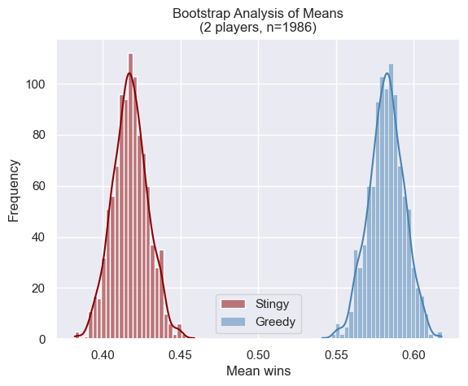
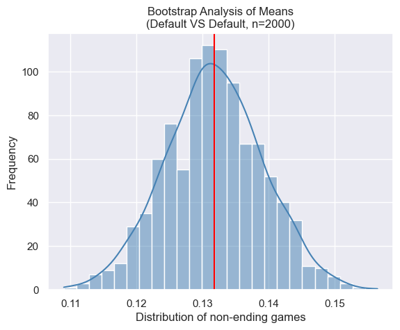

# 2023F CS2910 Project Report
**Group Members**
1. Zeyad Awad (362192)
2. Hashem Bader (362311)

# Summary of Game

The game is Monopoly. Monopoly is a board game of 2 to 8 players where each player
starts with $1500, a  chosen name and a strategy.
The game involves rolling dice to move around the board, triggering actions upon landing on specific squares.
As rounds progress, players will start gradually lose money
and elimination occurs when the player loses all his money.
To win the game, there should be only one player left that still has money.
In addition, we changed the name of the locations and made the theme middle eastern.
For more information, here is the link to the rules(https://www.hasbro.com/common/instruct/00009.pdf).

# Experiment Report
## Player Strategies
1. Greedy: 
    - Buys properties 70% of the time regardless of its type.
    - Builds a house 90% of the time if possible.
2. Stingy:
    - Buys properties 20% of the time regardless of its type.
    - Builds a house 10% of the time if possible.
3. Default:
    - Buys properties 50% of the time regardless of its type.
    - Builds a house 30% of the time if possible.
4. Station Guy: 
    - Buys properties 40% of the time, with an exception for stations, 90%.
    - Builds a house 30% of the time if possible.
5. Utility Guy: 
    - Buys properties 40% of the time, with an exception for utilities, 90%.
    - Builds a house 30% of the time if possible.

## Procedure
In the experiment, a game is created given the list of players with strategies and the board map. The winner of each trial is stored in a hash map which then exports the following data: strategy, money countries, utilities, stations, and totalLandsOwned of the winner into a CSV file for data analysis. When the simulation runs, information about each player is displayed before and after rolling the dice to give an understanding about what is happening. 

After the specified number of trials, e.g., 60, the program displays the number of games won per strategy. 

It is important to note that in a 2-player monopoly game, it is believed that 12% of the games in a simulation would not end (which matches our simulation!) according to this paper: [ESTIMATING THE PROBABILITY THAT THE GAME OF MONOPOLY NEVER ENDS](https://www.informs-sim.org/wsc09papers/036.pdf?fbclid=IwAR3kaMbPMHUb0MXR8hD9u8_w49IYBTQWYrQHd0auXGnQ3ssjdTwqRIlIDEs). For that reason, the program displays the number of non-ending games (which we defined to be when a player has more than 100,000$).
We then collect the CSV data for further data analysis in Python (mainly Pandas library). We compared a variety of games, namely:
- Greedy VS Stingy (2 players)
- Station Guy VS Utility Guy (2 players)
- All 5 strategies (5 players)

The results were interesting.

## Results

### Greedy vs Stingy:

| strategy | money | countries | utilities | stations | totalLandsOwned |
|----------|-------|-----------|-----------|----------|-----------------|
| GREEDY   | 3489.5| 16.0      | 2.0       | 3.0      | 20.0            |
| STINGY   | 1475.0| 3.0       | 0.0       | 1.0      | 4.0             |

Table 1.0: Player Strategies and Holdings

| Strategy |  Win Rate   |
|----------|-------------|
| GREEDY   | 0.582788    |
| STINGY   | 0.417212    |

Table 1.1: Win Rate Per Strategy

### Station Guy vs Utility Guy:

| strategy     | money | countries | utilities | stations | totalLandsOwned |
|--------------|-------|-----------|-----------|----------|-----------------|
| STATION_GUY  | 4906.0| 11.0      | 1.0       | 3.0      | 14.0            |
| UTILITY_GUY  | 9017.0| 11.0      | 1.0       | 1.0      | 14.0            |

Table 2.0: Player Strategies and Holdings

| Strategy     | Win Rate    |
|--------------|-------------|
| STATION_GUY  | 0.624718    |
| UTILITY_GUY  | 0.375282    |

Table 2.1: Win Rate Per Strategy

### All 5 Strategies (5 players):

| strategy     | money    | countries | utilities | stations | totalLandsOwned |
|--------------|----------|-----------|-----------|----------|-----------------|
| DEFAULT      | 40819.5  | 7.0       | 0.0       | 0.0      | 8.0             |
| GREEDY       | 21572.0  | 9.0       | 0.0       | 1.0      | 10.0            |
| STATION_GUY  | 41457.0  | 5.0       | 0.0       | 1.0      | 8.0             |
| STINGY       | 77198.5  | 4.0       | 0.0       | 0.0      | 4.5             |
| UTILITY_GUY  | 40519.0  | 5.0       | 1.0       | 0.0      | 7.0             |

Table 3.0: Player Strategies and Holdings

| Strategy     | Win Rate   |
|--------------|------------|
| GREEDY       | 0.533911   |
| DEFAULT      | 0.178932   |
| STATION_GUY  | 0.150072   |
| UTILITY_GUY  | 0.125541   |
| STINGY       | 0.011544   |

Table 3.1: Win Rate Per Strategy

### Default vs Default (EXTRA)

## Analysis
_An interpretation of your data explaining why one strategy is better than the other supported with 
data from your experiment.(500 words)_
### Greedy vs Stingy:
Our examination, detailed in Table 1.0, reveals that Greedy consistently outperforms Stingy in terms of average land ownership and financial gains, resulting in a commendable 58% win rate. To assess the statistical significance of this difference, bootstrapping was employed to generate multiple simulations from the dataset.

The results of our analysis, illustrated in Figures 1.0 to 1.3, underscore the distinct distributions of means between Greedy and Stingy. The 95% confidence interval (0.09, 0.11) excludes 0, signaling a statistically significant advantage for Greedy with 95% confidence. The box plots in Figure 1.2 and 1.3 provide further granularity, indicating that Greedy tends to conclude rounds with a financial range of $2000 to $5000 and approximately 20 owned lands. In contrast, Stingy tends to finish rounds with just under $2000 and roughly 4 owned lands.

In summary, our data strongly suggests that, in a 2-player game, Greedy is more likely to emerge victorious over Stingy.

### Station Guy vs Utility Guy:
Table 2.0 presents a comparative analysis of Station Guy and Utility Guy in 2-player games. Both strategies exhibit similar land distributions, barring stations, with Utility Guy consistently concluding the game with more monetary assets on average.

Our statistical analysis, employing bootstrapping and illustrated in Figures 2.0 to 2.3, further reinforces the differences in performance. Station Guy secures victory in approximately 59% of games, while Utility Guy achieves success in 41%. The 95% confidence interval (0.18, 0.20) excludes 0, affirming the statistical significance of Station Guy's superiority with 95% confidence.

The box plots in Figure 2.2 and 2.3 provide additional insights, indicating that Station Guy tends to conclude rounds with a financial range of a couple of thousand to $13,000 and around 14 owned lands. In contrast, Utility Guy ends rounds with a broader financial range of a couple of thousand to $20,000 while maintaining the same number of owned lands, 14.

In conclusion, our comprehensive analysis points to Station Guy as the more likely victor in a 2-player game over Utility Guy.

### All 5 Strategies:
Table 3.0 provides a comprehensive examination of strategies in 5-player games, revealing notable distinctions among the observed approaches. Surprisingly, despite Stingy possessing the fewest lands (4-5), it concludes the game with the highest monetary assets, approximately $77,000. In contrast, Greedy, with the most lands owned (10), possesses the least amount of money, roughly $22,000. The remaining strategies exhibit fairly comparable holdings.

The ranking of strategies based on win rate, as depicted in Table 3.1, is as follows: Greedy, Default, Station Guy, Utility Guy, and Stingy.

Further insights from the box plots in Figure 3.1 and 3.2 emphasize the financial and land ownership dynamics. Stingy tends to conclude rounds with a financial range of just under $60,000 to just above $80,000 and around 4-5 owned lands. In contrast, Greedy ends rounds with a narrower financial range of below $20,000 to $30,000 and a wider range of lands owned, averaging between 9 and 12. The other strategies exhibit a comparable spread of money and lands, except for Utility Guy, which has a narrower range of lands owned (6-8).

In conclusion, our comprehensive analysis suggests that Greedy stands out as the more likely victor in a 5-player game among the observed strategies.

### Default vs Default (EXTRA):
Surprisingly, our 2-player game simulation results for default strategies align closely with findings presented in the paper titled: [ESTIMATING THE PROBABILITY THAT THE GAME OF MONOPOLY NEVER ENDS](https://www.informs-sim.org/wsc09papers/036.pdf?fbclid=IwAR3kaMbPMHUb0MXR8hD9u8_w49IYBTQWYrQHd0auXGnQ3ssjdTwqRIlIDEs).
Figure X.0 illustrates that the observed value of 0.12 falls within the plausible range, indicating that the proportion of non-ending games in a 2-player default strategy game is not statistically different from 0.12. This alignment with established research lends credibility to our simulation outcomes.

# Reflection
_A reflection on your experiences with generative AI during this project. Provide a few sentences reflecting
on your experience with AI for each of the following prompts._ 

### What generative AI did you use, and what tasks did you use it for?
ChatGPT: supporting with the test cases to cover most of the simple test cases. Also helped a lot with the documentation of classes and methods to cover all the details.

### How did you learn about the tools used by your group (delete ones that don't apply)?
All of the tools that have been used were learned in the class, like IntelliJ IDEA Debugger, git and jUnit. Some of the tools we had to search for it in google for more clarification, .

### Reflecting on your experience:

The generative AI (ChatGPT) was really helpful, ChatGPT ability to suggest test cases helped in covering various scenarios,
improving the robustness of the test cases. The AI was valuable in ensuring that the codebase was well-documented and more understandable for developers.
In another hand, there were limitations encountered using generative AI. The AI might have limitations in assisting with complex calculations, specifically in determining rents or other intricate game mechanics,
which impacted that particular aspect of the project. Also the AI was not providing complex and correct test cases, we always have to adjust the code to make it work and make a complex test cases.
Overall, The use of generative AI positively impacted the comprehensiveness and clarity of the test cases and documentation,
leading to a more solid codebase.
Considering that generative AI might struggle with intricate calculations, exploring alternate methods or seeking additional domain-specific knowledge
might have helped in developing more accurate and complex game mechanics, such as rent calculations, to better mirror the reality of the game.
This could have further enhanced the project's fidelity and completeness.

# Bonus Consideration:
The data analysis that was provided in effeciency and covering all the details.
Also using the method that has t as an parameter.
